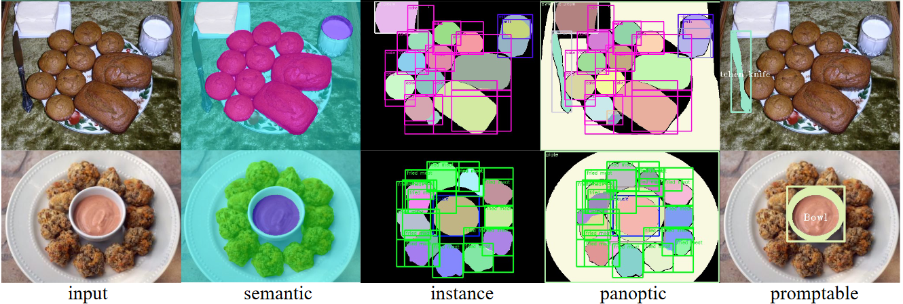
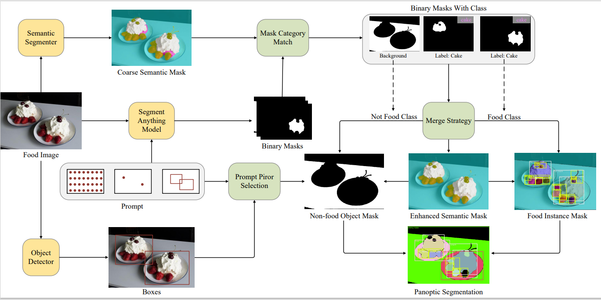
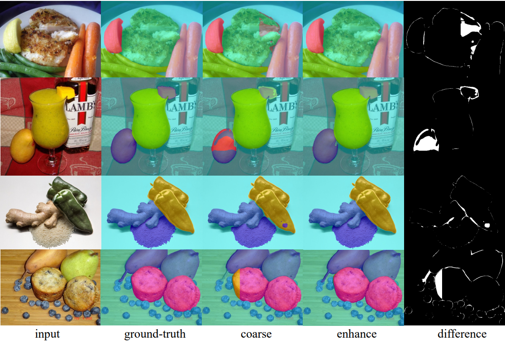
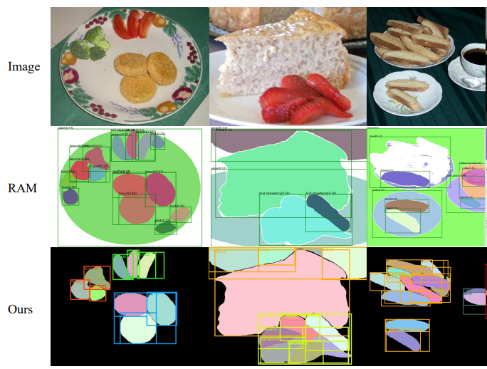
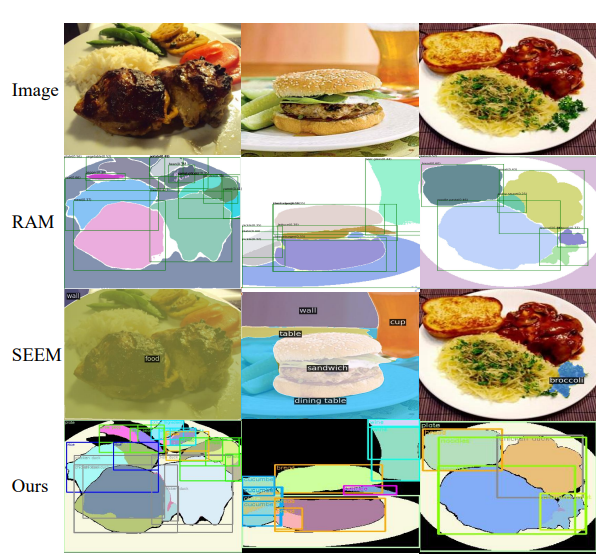

# FoodSAM: Any Food Segmentation


This is the official PyTorch implementation of our paper:
FoodSAM: Any Food Segmentation.

---

Segment anything Model(SAM) demonstrates significant performance on various segmentation benchmarks, showcasing its impressing zero-shot transfer capabilities on 23 diverse segmentation datasets. However, SAM lacks the class-specific information for each mask. To address the above limitation and explore the zero-shot capability of the SAM for food image segmentation, we propose a novel framework, called FoodSAM. This innovative approach integrates the coarse semantic mask with SAM-generated masks to enhance semantic
segmentation quality. Besides, it can perform instance segmentation on food images. Furthermore, FoodSAM extends its zero-shot capability to encompass panoptic segmentation by incorporating an object detector, which renders FoodSAM to effectively capture non-food object information. Remarkably, this pioneering framework stands as the first-ever work to achieve instance, panoptic, and promptable segmentation on food images. 

[[`Paper`]()] 



FoodSAM contains three basic models: SAM, semantic segmenter, and object detector. SAM generates many class-agnostic binary masks, the semantic segmenter provides food category labels via mask-category match, and the object detector provides the non-food class for background masks. It then enhances the semantic mask via merge strategy and produces instance and panoptic results. Moreover, a seamless prompt-prior selection is integrated into the object detector to achieve promptable segmentation.

  

## Installation
Please follow our [installation.md](installation.md) to install.


## <a name="GettingStarted"></a>Getting Started

You can run the model for semantic and panoptic segmentation in a few command lines.
```
python FoodSAM/semantic.py --img_path <path/to/img> --output <path/to/output> 
```
```
python FoodSAM/panoptic.py --img_path <path/to/img> --output <path/to/output>
```
Masks can also be generated for a folder of images by setting `args.data_root`. Furthermore, by setting `args.eval` to true, the model can output the semantic masks and evaluate the metrics. 

Here are examples of semantic segmentation and panoptic segmentation on the FoodSeg103 dataset:
```
python FoodSAM/semantic.py --data_root dataset/FoodSeg103/Images --output Output/Semantic_Results --eval 
```
```
python FoodSAM/panoptic.py --data_root dataset/FoodSeg103/Images --output Output/Sanoptic_Results
```

## Quantitative results

### FoodSeg103
| Method | mIou | aAcc | mAcc 
| :-: | :- | -: | :-: |  
|[SETR_MLA(baseline)](https://github.com/LARC-CMU-SMU/FoodSeg103-Benchmark-v1) | 45.10 | 83.53 | 57.44
FoodSAM | 46.42 | 84.10 |  58.27

### UECFOODPIXCOMPLETE

| Method | mIou | aAcc | mAcc 
| :-: | :- | -: | :-: |  
|deeplabV3+ (baseline)| 65.61 |88.20| 77.56
FoodSAM | 66.14 |88.47 |78.01

## Qualitative results
### semantic segmentation results 
 
 
### instance segmentation results


### panoptic segmentation results


## Acknowledgements

A large part of the code is borrowed from the following wonderful works:

1. [Segmentation Anything](https://github.com/facebookresearch/segment-anything)

2. [UniDet](https://github.com/xingyizhou/UniDet)

3. [FoodSeg103](https://github.com/LARC-CMU-SMU/FoodSeg103-Benchmark-v1)

4. [mmsegmentation](https://github.com/open-mmlab/mmsegmentation)

## License

The model is licensed under the [Apache 2.0 license](LICENSE).

## Citation
If you want to cite our work, please use this:

```
@article

```
